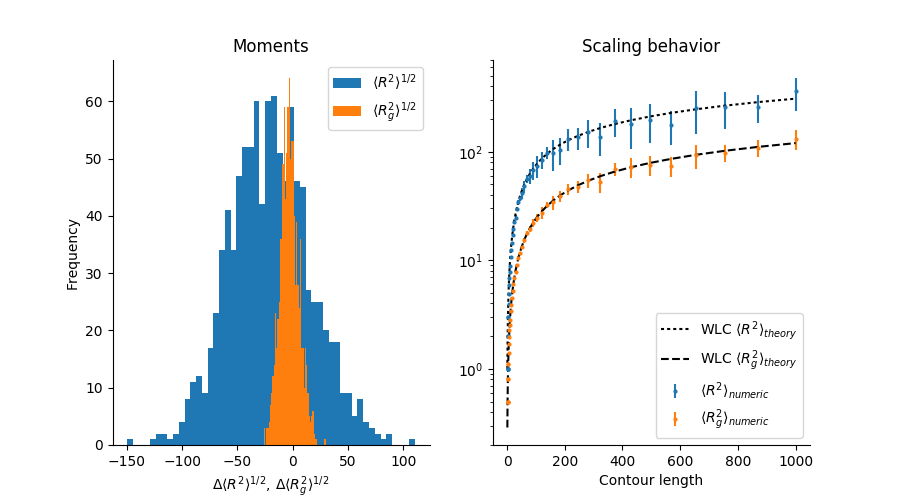

.. PolymerCpp documentation master file, created by
   sphinx-quickstart on Wed May 31 07:03:27 2017.
   You can adapt this file completely to your liking, but it should at least
   contain the root `toctree` directive.

PolymerCpp
==========

3D wormlike chain generator for Python and written in C++.

.. image:: _images/wlc_realization.png

.. toctree::
   :maxdepth: 2
   :caption: Contents:

About
=====

PolymerCpp is a small program for generating three-dimensional
wormlike chains (WLC), a common and relatively simple model in polymer
physics. A WLC describes a semi-flexible polymer, i.e. one that is
rigid over short length scales and flexible over long ones. The
characteristic length scale that separates these two regimes is known
as the persistence length.

PolymerCpp provides a number of Python functions that exposes the C++
routines for generating 3D WLCs, including

1. infinitesimally thin WLCs
2. self-avoiding WLCs

PolymerCpp was written by `Marcel Stefko
<https://github.com/MStefko>`_ and `Kyle M. Douglass
<https://github.com/kmdouglass>`_ in the `Laboratory of Experimental
Biophysics <http://leb.epfl.ch/>`_ for modeling DNA.

User Guide
==========

Installation
------------

Nix
+++

Install PolymerCpp into your current profile::

  nix-env -f PolymerCpp.nix -i '.*'

Activate an interactive shell with Python and the PolymerCpp package
without actually installing PolymerCpp::

  nix-shell shell.nix --pure

Source Installs
+++++++++++++++

Install the Python package::

  python setup.py

Compile just the shared library::

  make

Chain Simulation
-----------------

To begin, start the Python interpreter and import the function to
generate wormlike chains into the session's namespace::

  >>> from PolymerCpp.helpers import getCppWLC

A single realization of an infinitesimally thin wormlike chain
requires two input arguments: the chain length and the persistence
length::

  >>> pathLength = 500
  >>> persisLength = 50

A single realization of the chain is generated by a call to
getCppWLC.::

  >>> chain = getCppWLC(pathLength, persisLength)

A self-avoiding WLC may also be simulated. This requires setting the
diameter of the exclusion volume centered around each chain
segment. The diameter is also specified in units of chain segments and
cannot exceed 1::

  >>> from PolymerCpp.helpers import getCppSAWLC
  >>> linkDiameter = 0.75
  >>> chain = getCppSAWLC(pathLength, persisLength, linkDiameter)

Verification of the Algorithms
------------------------------

PolymerCpp.algorithms contains a utility function that performs two
numerical experiments for verifying the accuracy of the algorithm. In
the first, it calculates chain realizations for a given number of
groups and a given number of chain realizations in each for each
group. The mean end-to-end distance `R` and mean radius of gyration
`Rg` is computed for each group and a histogram of the results is
displayed. The x-axis is the difference between the computed mean and
the theoretical mean.

In the second experiment, a number of chains equal are simulated for a
range of chain contour lengths.  The mean end-to-end distance and mean
radius of gyration for each group is then plotted vs. the contour
length, along with the theoretical predications. The error bars denote
the standard deviation of the group.::

  from PolymerCpp.algorithms import verifyWLC
  verifyWLC(getCppWLC)

This will print a summary to the console and display a figure similar
to the following:

You may change a number of settings by specifying arguments to the
function::

  verifyWLC(getCppSAWLC,
            numChains=50,
	    numExperiments=500,
	    pathLength=800,
	    persisLength=20,
	    linkDiameter=0.5)

Bias
++++

The bias observed in the radius of gyration at short distances is due
to the fact that the chain is represented by the coordinates of the
endpoints of its segments. The radius of gyration of a line of unit
length is :math:`1 / \left( 2 \sqrt{3} \right)`, whereas the radius of
gyration of a set consisting of only its endpoints is :math:`1 /2`.

Algorithm
=========

Wormlike Chain
--------------

The WLC algorithm is based on a discretized version of the original
`Kratky-Porod model`_ of a continuous semiflexible polymer. To our
knowledge, the algorithm was first described in Ref. [#f1]_ and was
therein referred to as the random :math:`\phi` model. In this model,
the chain is approximated as a series of discrete segments of equal
length. In spherical coordinates, the change in direction between
successive segments is described by two angles: the zenith angle
:math:`\theta` and the azimuthal angle :math:`\phi`. The azimuthal
angle is allowed to vary randomly and uniformly between :math:`0` and
:math:`2\pi` (hence the model's name). The zenith angle however is a
random number whose probability distribution function (p.d.f.)
reflects the rigidty of the polymer.

The p.d.f. for the zenith angle is derived by considering the change
in local free energy due entirely to bending of the polymer between
segments. (Any energy due to other forces between the segments,
e.g. torsion, are ignored.) The Taylor series expansion about
:math:`\theta_i = 0` for the change in local free energy :math:`\Delta
U_i \left( \theta \right)` between segments :math:`i` and :math:`i+1`
is

.. math::

   \Delta U_i \left( \theta_i \right) = \frac{d U_i}{d \theta_i} \theta_i + \frac{1}{2} \frac{d^2 U_i}{d \theta_i^2} \theta_i^2 + \ldots

At equilibrium, the the first derivative is zero. Under this condition
and ignoring all terms of third order and higher, the p.d.f. for
:math:`\theta` may be obtained by substituting the expansion for the
local free energy change into the Boltzmann distribution :math:`p \left(
\Delta U \right) \sim \exp \left( \frac{- \Delta U}{k_B T} \right)`

.. math::

   p \left( \theta \right) \sim N^{-1/2} \exp \left( \frac{-a_i \theta_i^2}{2} \right) sin \, \theta_i

where :math:`N^{-1/2}` is a normalization constant, :math:`a_i =
U_i''/k_B T`, and :math:`sin \, \theta_i` is a weighting factor that
reflects the fact that the integration over the number of possible
bending angles in spherical coordinates has a differential solid angle
:math:`d \Omega = sin \, \theta \, d \theta \, d \phi`.

Normalizing this distribution is difficult because of the presence of
:math:`sin \, \theta_i` in the expression above. However, if
:math:`a_i` is sufficiently large (i.e. the polymer is sufficiently
rigid), then :math:`sin \, \theta_i` may be approximated as
:math:`\theta_i` and the normalization is easily performed by
extending the limits of integration to infinity.

.. math::

   \int_0^\infty \exp \left( \frac{-a_i \theta_i^2}{2} \right) \theta_i \, d \theta_i = \frac{1}{a_i}, \quad a_i = 2 \pi N^{-1/2}

The last equation is a result of integrating over the azimuthal angle
from :math:`0` to :math:`2 \pi`. Finally, assuming that :math:`a_i` is the
same for the bending between each segment, we arrive at a Rayleigh
distribution for the zenith angle between segments.

.. math::
   
   p \left( \theta \right) = a \exp \left( \frac{a \theta^2}{2} \right) \times \theta

In the simulation, the chain is created by simulating a random walk on
the surface of the unit sphere. The walk begins at a predefined point
on the sphere, typically the defined by the vector :math:`\left( 1, 0,
0 \right)` in Cartesian coordinates. The next step of the walk is
generated by selecting a random direction in the plane tangent to the
sphere at that point and that is uniformly distributed between
:math:`0` and :math:`2 \pi`. The length of the displacement in this
plane is calculated by taking the *sine* of a random variate

.. math::

   \theta = \sqrt{\frac{-2}{a} \ln \left( 1 - X \right)}

where :math:`X` is a random variate uniformly distributed between 0
and 1. This transformation produces random numbers with a p.d.f. for
:math:`\theta` that is equivalent to the expression derived above.

After moving a distance :math:`\sin \, \theta` in the tanget plane in
the direction defined by :math:`\phi`, the new point is back-projected
onto the sphere and defines the next point in the walk. This is
repeated a pre-defined number of times and the final chain is
calculated by cumulative summation over all the vectors in the walk.

According to Ref. [#f1]_, the parameter :math:`a` is--to very high
accuracy--equivalent to the chain's persistence length. For this
reason, we use the approximation

.. math::

   a = \ell_p

Strictly speaking, the persistence length of the chain in this model
is

.. math::

   \ell_p = \frac{1}{1 - L \left( a \right) }

where :math:`L \left( a \right)` is the `Langevin function
<https://en.wikipedia.org/wiki/Brillouin_and_Langevin_functions#Langevin_function>`_.

This algorithm generates an infinitesimally thin wormlike chain
because no collision checking is performed.

.. _`Kratky-Porod model`: https://en.wikipedia.org/wiki/Worm-like_chain

Self-avoiding wormlike chain
----------------------------

The self-avoiding WLC is modeled a series of spheres whose
center-to-center distances is fixed for successive spheres. The zenith
angle between the segments joining successive spheres is determined in
the same manner as described for the wormlike chain. For each
successive sphere, a candidate sphere is generated and checked for
collisions with other spheres in the chain. If there is a collision,
the sphere is erased and another sphere is generated.
	     
Indices and tables
==================

* :ref:`genindex`
* :ref:`modindex`
* :ref:`search`

.. rubric:: Footnotes

.. [#f1] `Schellman, J. A., "Flexibility of DNA," Biopolymers 13,
         217-226
         (1974). <http://onlinelibrary.wiley.com/doi/10.1002/bip.1974.360130115/abstract>`_
